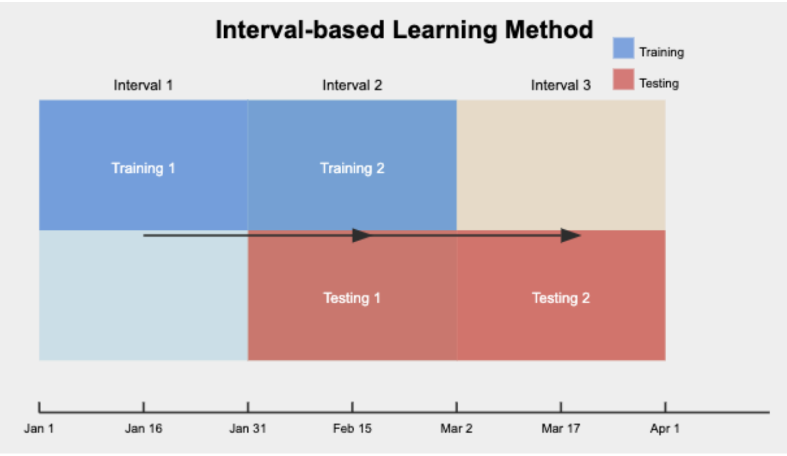

# Stock Trading with Reinforcement Learning

This project implements reinforcement learning (RL) models to perform stock trading. The goal is to train RL agents that can learn from historical stock data and make informed trading decisions. The project leverages various techniques, including online normalization and dynamic feature extraction, to ensure the agent operates effectively in dynamic market conditions.

## Running the Project

To run the project, simply execute the `main.py` script. All parameters and settings for the model, training, and environment are configured within the `config.py` file. There's no need to provide additional command-line arguments, as everything is already set in the configuration file.

Run the project with the following command:

```bash
python main.py
```

---

## Interval-Based Training Strategies

This project explores the application of reinforcement learning (RL) to stock portfolio management, with a focus on interval-based training strategies. By dividing the trading period into fixed intervals, we evaluate whether an agent should be retrained from scratch for each interval or retain knowledge across intervals. The project compares various reinforcement learning models to assess their performance in a dynamic trading environment.



## Models and Results

We evaluated several reinforcement learning models, but the **DQN-GRU-CNN** model performed best. Below are the main results:

### DQN-GRU-CNN Model

The DQN-GRU-CNN model combines the strengths of **Convolutional Neural Networks (CNNs)** for recognizing spatial patterns in stock prices with **Gated Recurrent Units (GRUs)** for capturing temporal dependencies. This model showed the best results for managing stock portfolios.

#### Key Features:
- **CNN** layers help the model recognize short-term trends in stock prices.
- **GRU** layers allow the model to retain memory of past trends and handle sequential data.
- **Interval-based training** strategy divides the trading period into fixed intervals (e.g., 30 or 60 days).
- **Fresh mode** where the model starts with a fresh agent each interval was more effective than retraining.

#### Performance:

- **DQN-GRU-CNN** outperformed the Buy-and-Hold strategy and baseline models across all tested stocks.
- The **fresh mode** strategy allowed the model to generalize well, avoiding overfitting seen in retrain mode.
- Successfully generalized to new stocks not seen during the initial testing.

#### Comparison:
- **Exploration-Exploitation Balance**: The DQN algorithm uses an $\epsilon$-greedy strategy, balancing exploration and exploitation, making it particularly well-suited for dynamic environments like stock trading.
- **Policy Gradient Methods**: Compared to DQN, policy gradient methods struggled to handle the high volatility of the stock market and often became trapped in suboptimal strategies.

### Graphs and Performance Plots
*(Graphs for performance metrics and model comparison will be added here)*

## Methodology

The stock trading problem was modeled as a **Markov Decision Process (MDP)**, where the agent interacts with the environment to maximize portfolio returns. 

- **States**: Market and portfolio conditions, represented primarily by stock prices.
- **Actions**: Simplified to either "Buy All" (investing the entire portfolio in a stock) or "Sell All" (converting the portfolio to cash).
- **Reward Function**: The logarithmic return of the portfolio value was used to calculate the reward.
  
### Algorithms Tested

- **Q-Learning**: Struggled due to the discrete state space and lack of temporal memory.
- **Policy Gradient**: Showed poor generalization in volatile markets.
- **DQN-GRU-CNN**: The best-performing model, leveraging both spatial and temporal features for optimal performance.

### Baseline Model

A **Price Comparison Agent** was used as a baseline, which compared stock prices at the beginning and end of each interval. While simple, this model served as a useful reference point for evaluating the RL agents.

## Results Summary

- The **DQN-GRU-CNN** model in fresh mode consistently outperformed both the Buy-and-Hold strategy and the baseline model across all stocks.
- Fresh training enabled the model to adapt to market changes without overfitting, making it more robust for real-world trading scenarios.

### Parameter Tuning

- **Learning Rate**: A small learning rate of `0.000001` helped avoid overfitting.
- **Episodes**: Limited training episodes (10) were sufficient due to the small dataset.
- **Exploration Rate**: Starting at `0.4` with a decay factor of `0.995` allowed for a good exploration-exploitation balance.
- **GRU and CNN Layers**: The use of 3 GRU layers (hidden size 128) and multiple CNN layers enabled the model to effectively capture both short-term and long-term trends.

## Conclusion

The **DQN-GRU-CNN** model proved to be the best approach for interval-based stock trading. By effectively balancing exploration and exploitation, while using a combination of CNN and GRU layers, this model outperformed simpler reinforcement learning models and baseline strategies. Future improvements could include the incorporation of sentiment analysis and ensemble methods for further enhancing performance.

### Future Work:
- **Sentiment Analysis**: Integrating news and social media sentiment into the model could improve decision-making.
- **Ensemble Methods**: Combining multiple models to improve robustness and accuracy.
- **Regularization**: Techniques like dropout or weight decay could help reduce overfitting.
---

**Authors:**
- Ariel Abramovitz (Student ID: 316019116)
- Esther Berestetsky (Student ID: 2120248185)
- Tal Barda (Student ID: 208729210)

[The codebase on GitHub](https://github.com/tal-huji/AI_PROJECT)
